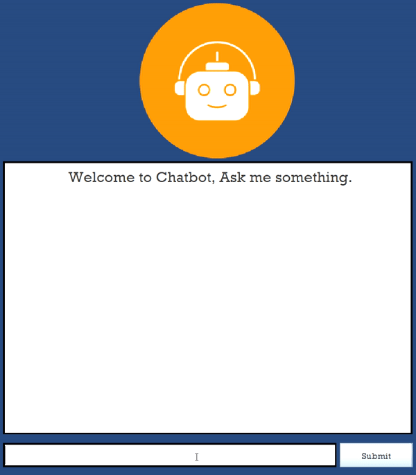

# Java Swing Chatbot


## Example demo


Java Swing Chatbot is a simple chatbot application built with Java Swing. It allows users to interact with the chatbot, ask questions, and get responses. The chatbot can answer predefined questions from a database and also perform Google searches for unknown queries.

## Table of Contents

- [Features](#features)
- [Prerequisites](#prerequisites)
- [Getting Started](#getting-started)
- [Usage](#usage)
- [Database Setup](#database-setup)
- [Contributing](#contributing)

## Features

- **User-Friendly Interface**: The chatbot interface is built using Java Swing, providing a simple and intuitive user experience.

- **Query Responses**: Users can ask questions, and the chatbot can respond with predefined answers if available.

- **Mathematical Expression Evaluation**: The chatbot can evaluate simple mathematical expressions.

- **Database Integration**: Predefined questions and answers are stored in a database, making it easy to extend the chatbot's knowledge.

- **Google Search**: When the chatbot doesn't have a predefined answer, it can perform a Google search to find relevant information.

- **Error Handling**: The chatbot handles errors gracefully, providing feedback for invalid queries or expressions.

- **Customizable**: You can easily customize the chatbot's responses and add more predefined answers to the database.

## Prerequisites

Before you begin, ensure you have met the following requirements:

- **Java Development Kit (JDK)**: You need to have Java installed on your system.

- **MySQL Database** (Optional): If you want to use the predefined answer database.

- **Internet Connectivity**: Required for Google searches.

## Getting Started

To get started with the Java Swing Chatbot project, follow these steps:

### Prerequisites

Before you begin, ensure you have met the following requirements:

- **Java Development Kit (JDK)**: You need to have Java installed on your system.

- **MySQL Database** (Optional): If you want to use the predefined answer database.

- **Internet Connectivity**: Required for Google searches.

### Installation

1. Clone the repository to your local machine:

   ```bash
   git clone https://github.com/your-username/chatbot-project.git

## Usage

1. Open the project in your favorite Java IDE (e.g., Eclipse, IntelliJ IDEA).

2. Make sure you have the necessary libraries for Java Swing and JDBC.

3. Customize the database connection details in the `establishConnection` method of `ChatbotUsingJswing.java`.

4. If you want to use the predefined answer database, import the `QueriesAndResult.sql` file provided in the project to set up the database schema and initial data.

5. Build and run the project.

### Running the Application

- Launch the chatbot application.

- Enter your query or mathematical expression in the text field.

- Click the "Go" button to submit your query.

- The chatbot will respond with an answer or perform a Google search if it doesn't have a predefined answer.


## Database Setup

If you choose to use the predefined answer database, follow these steps:

1. Create a MySQL database.

2. Import the `QueriesAndResult.sql` file provided in the project to set up the database schema and initial data.

3. Update the `establishConnection` method in `ChatbotUsingJswing.java` with your database connection details.

## Contributing

Contributions are welcome! If you'd like to contribute to this project, please follow these steps:

1. Fork the repository on GitHub.

2. Clone your forked repository to your local machine.

3. Create a new branch for your feature or bug fix: `git checkout -b feature/your-feature-name`.

4. Implement your changes and test thoroughly.

5. Commit your changes: `git commit -m "Add your commit message here"`.

6. Push your changes to your forked repository: `git push origin feature/your-feature-name`.

7. Create a pull request on the original repository, describing your changes and improvements.


